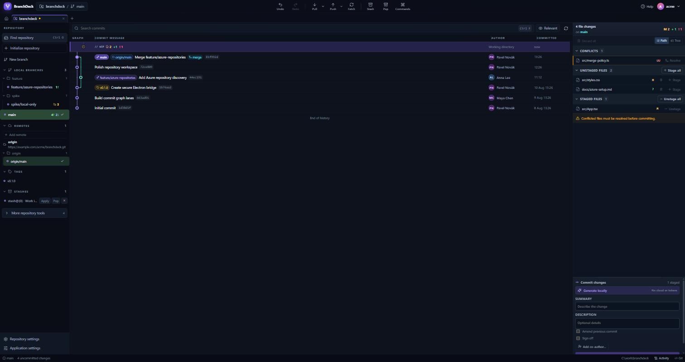

<div align="center">
  

  <h1>BranchDeck</h1>

  <p><strong>A graph-first desktop Git client for Windows.</strong></p>
  <p>Review, stage, commit, branch, investigate, and recover—without losing sight of your history.</p>

  <p>
    <a href="https://github.com/PanBronty/BranchDeck-Releases/releases/latest"></a>
    
    
  </p>
</div>



## Download

Go to the **[latest release](https://github.com/PanBronty/BranchDeck-Releases/releases/latest)** and
choose the build that suits you:

| Build | Best for | How it works |
| --- | --- | --- |
| **`BranchDeck-…-setup.exe`** | Most people | Guided per-user installation, Start menu shortcut, clean uninstall, and in-app updates on demand. |
| **`BranchDeck-…-portable.exe`** | Trying it without installing | Run the single executable from anywhere. Replace it manually when a newer version is released. |

### Requirements

- Windows 10 or Windows 11, x64
- [Git for Windows](https://git-scm.com/download/win)
- No BranchDeck account and no administrator access required

BranchDeck uses your existing Git installation. Git Credential Manager, included with Git for
Windows by default, enables browser sign-in for supported hosting providers.

## Why BranchDeck?

- **Keep the graph in view** while working with branches, commits, tags, and your working tree.
- **Stage precisely** by file, hunk, or individual line with unified and side-by-side diffs.
- **Handle advanced Git workflows** including interactive rebase, cherry-pick, revert, reset,
  bisect, blame, reflog, stashes, patches, and conflict resolution.
- **Work across providers** with GitHub, GitLab, Bitbucket Cloud, and Azure DevOps repositories and
  pull requests.
- **Stay local-first:** no telemetry, no BranchDeck cloud service, and credentials remain in
  Windows' encrypted credential storage.
- **Generate commit messages locally** with an optional on-device model. Repository diffs do not
  leave your machine.

## Install safely

Every executable has a matching `.sha256` file in the Release assets. Verify a download in
PowerShell before running it:

```powershell
Get-FileHash .\BranchDeck-0.9.4-setup.exe -Algorithm SHA256
Get-Content .\BranchDeck-0.9.4-setup.exe.sha256
```

The two hashes should match.

> [!IMPORTANT]
> BranchDeck is not code-signed yet. Windows SmartScreen may display **Windows protected your PC**
> because the publisher is unknown. Verify the checksum, then choose **More info → Run anyway** if
> you trust this official download.

## Updates

Installed builds check the public feed quietly on startup and announce only a newer version.
Nothing downloads until you approve it, and a current version or temporary network failure stays
silent. The notice opens **Settings › Updates**, where checking, downloading, progress, and the
explicit **Restart and install** action stay together. Portable builds are updated by downloading
and replacing the executable.

## Evaluation release

BranchDeck is currently available under a free [evaluation licence](./LICENSE). The application
source is maintained in a separate private repository and is not published here. GitHub's
automatically generated source archives for this repository contain only this download page,
licence, and presentation images—not the BranchDeck application source.

Questions or feedback: [pavel.p.kocian@gmail.com](mailto:pavel.p.kocian@gmail.com)
